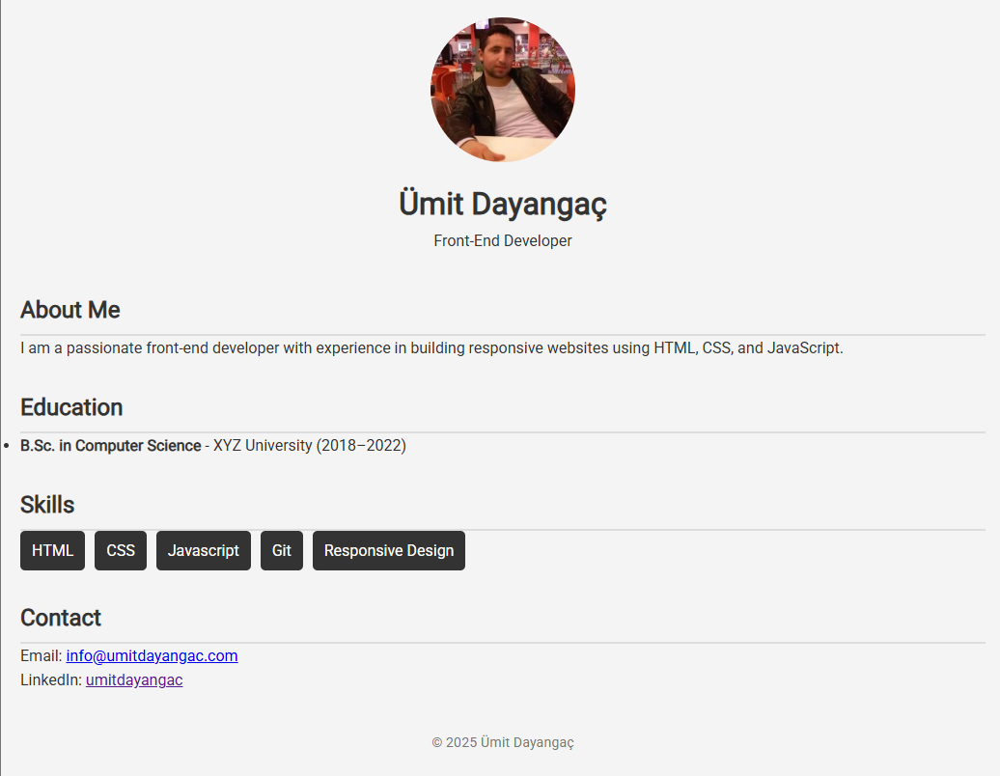

# Personal CV Website

A simple and responsive personal CV (resume) website built using **HTML** and **CSS**. This project is part of a front-end developer learning path focused on mastering the fundamentals of web development through hands-on projects.

## 📸 Preview

## 🚀 Features

- Semantic HTML structure
- Responsive layout (mobile-friendly)
- Clean and modern design
- Flexbox-based skill layout
- Font and image usage
- Organized folder structure

## 🧰 Technologies Used

- HTML5
- CSS3 (Flexbox, Media Queries)
- Google Fonts

## 📁 Project Structure

