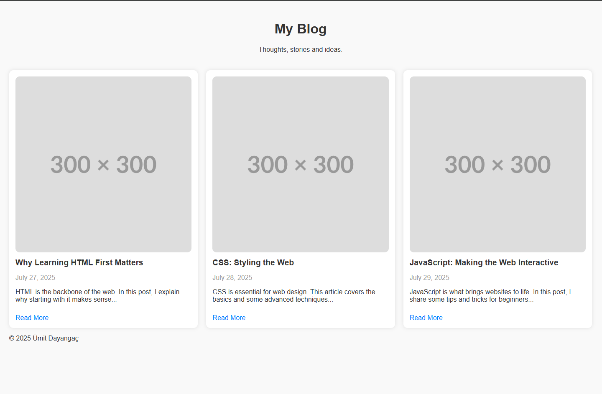

# Simple Blog Template

A responsive and clean blog homepage built with **HTML5** and **CSS3**.  
This project simulates a blog layout with multiple blog post cards and responsive design using **CSS Grid**.

## 📸 Preview

## 🚀 Features

- Responsive design with CSS Grid
- Semantic HTML5 elements
- Blog cards with image, title, date, excerpt and link
- Modern styling and spacing
- Hover effect on cards and links (optional)

## 🧰 Technologies Used

- HTML5
- CSS3
- Google Fonts (optional)

## 📁 Folder Structure

02-simple-blog/
├── index.html
├── assets/
│   ├── css/
│   │   └── style.css
│   └── img/
│       ├── blog1.jpg
│       ├── blog2.jpg
│       ├── blog3.jpg
│       └── Screenshot.png
└── README.md 

## 📱 Responsive Design

The layout adapts to all screen sizes using `auto-fit` and `minmax()` in CSS Grid.
On mobile devices, the blog posts stack vertically.

## 📚 Learning Objectives

- Learn to structure a page using semantic HTML tags like `<header>`, `<section>`, `<article>`, `<footer>`.
- Practice CSS Grid to build responsive card layouts.
- Improve UI/UX design through padding, spacing, and font usage.
- Prepare for real-world blog and content-heavy websites.

## ✍️ Author

- **Ümit Dayangaç**
- GitHub: [umit-dayangac](https://github.com/umit-dayangac)

---

> This project is part of a professional front-end development journey focused on building real-world layouts and mastering the fundamentals through hands-on projects.
