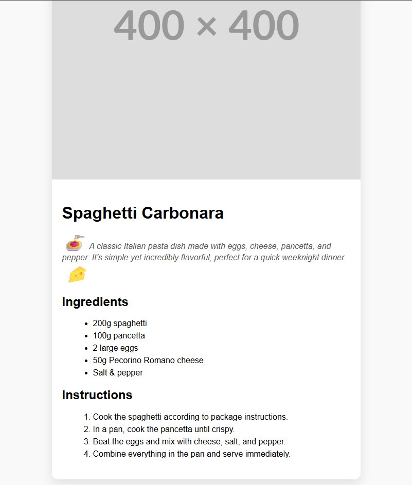

# Recipe Card

A responsive and clean recipe card layout built using **HTML5** and **CSS3**.  
This project simulates a cooking recipe card, showing an image, title, description, ingredients, and preparation steps inside a single structured and visually appealing card.

## 📸 Preview

## 🚀 Features

- Responsive single-column card design
- Semantic HTML structure using `<section>`, `<ul>`, `<ol>`, `<h1>`–`<h2>`, etc.
- Shadowed container with rounded corners
- Mobile-friendly layout with media queries
- Modern styling with spacing and readability focus

## 🧰 Technologies Used

- HTML5
- CSS3 (Flexbox/Grid optional)
- Google Fonts (optional)

## 📱 Responsive Design

The layout adapts to smaller screens (max-width: 600px) by reducing padding and font sizes, making it mobile-optimized.

## 📚 Learning Objectives

- Practice content hierarchy in HTML using semantic tags
- Create beautiful single-column layout using box model
- Work with `ul` and `ol` for listing structured content
- Design responsive card elements with modern styling
- Build real-world reusable UI components

## ✍️ Author

- **Ümit Dayangaç**
- GitHub: [umit-dayangac](https://github.com/umit-dayangac)

---

> This is part of a professional front-end developer journey, building real-world UI components step by step.

