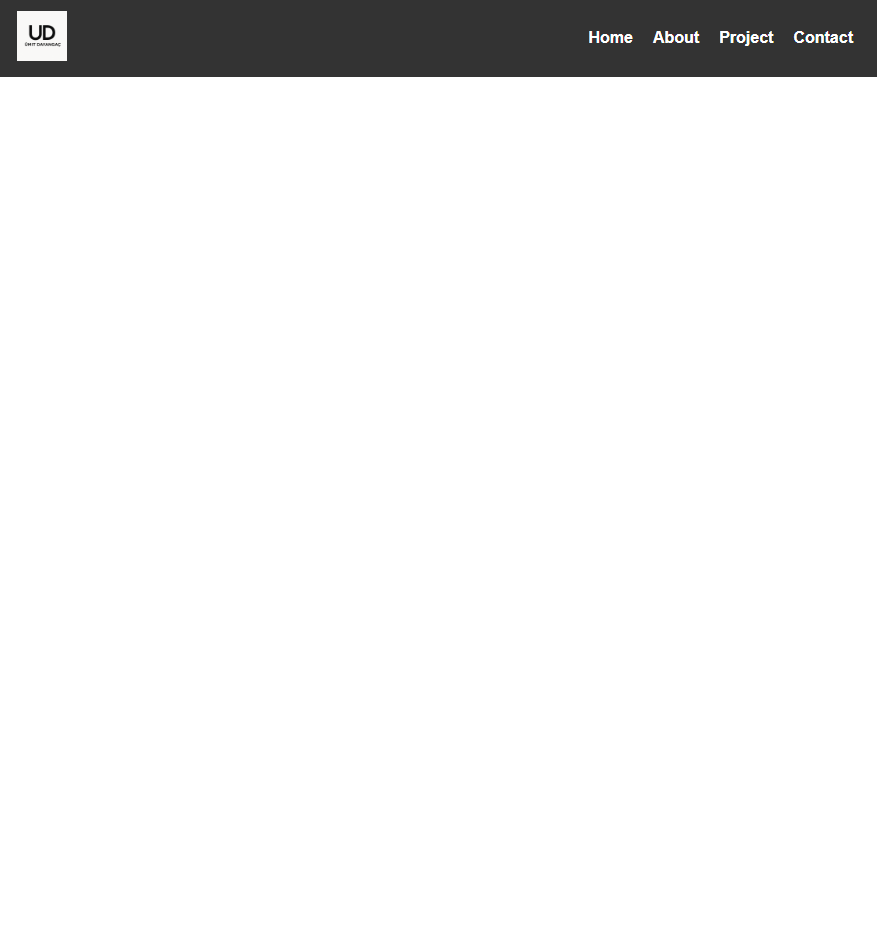

# Responsive Navbar

A responsive and mobile-friendly navigation bar built with **HTML**, **CSS**, and **JavaScript**.  
This project features a sticky top navigation bar with a logo, navigation links, and a hamburger menu for smaller screens.

## 📸 Preview

## 🚀 Features

- Sticky header that stays at the top during scroll
- Fully responsive design using media queries
- Hamburger menu that toggles navigation on mobile devices
- Smooth toggle animations (optional)
- Semantic and accessible HTML structure

## 🧰 Technologies Used

- HTML5
- CSS3 (Flexbox, Media Queries)
- Vanilla JavaScript (ES6+)

## 📱 Responsive Behavior

- On screens wider than 768px: horizontal navigation menu is visible.
- On screens narrower than 768px: hamburger icon appears; clicking toggles vertical menu.

## 🧠 Learning Objectives

- Practice layout building with Flexbox
- Create interactive UI using DOM manipulation
- Understand and implement sticky headers
- Write clean, scalable, mobile-first CSS

## ✍️ Author

- **Ümit Dayangaç**
- GitHub: [umit-dayangac](https://github.com/umit-dayangac)

---

> This is part of a front-end mastery path, designed to build reusable UI components and elevate layout/UX skills for real-world development.

