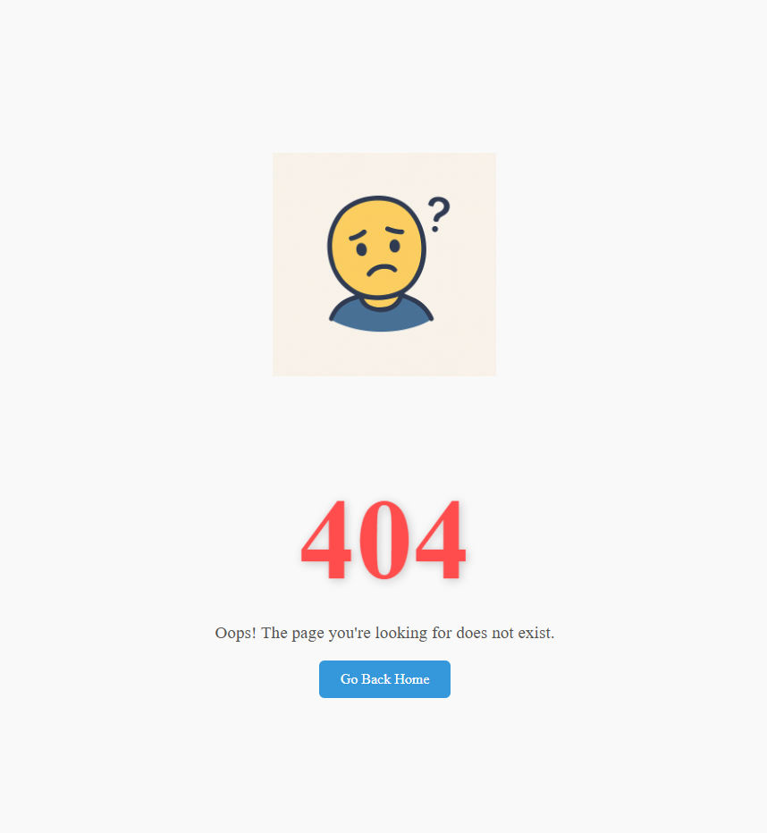

# 404 Error Page

A custom and responsive **404 Not Found** error page designed using **HTML5** and **CSS3**.  
This component displays a clear, minimal message when a user lands on a non-existent route and guides them back home with a styled button.

## 📸 Preview

## 🚀 Features

- Minimal, centered design with large "404" error code
- Responsive layout with image and message
- Styled button to guide users back to homepage
- Soft animations and custom color palette (optional)
- Fully accessible and semantic HTML

## 🧰 Technologies Used

- HTML5
- CSS3 (Flexbox, animations, media queries)
- SVG / PNG illustrations (optional)

## 📱 Responsive Behavior

The layout scales smoothly across all screen sizes.  
Typography, spacing, and buttons adjust automatically for mobile users.

## 📚 Learning Objectives

- Handle invalid routes gracefully with UI feedback
- Improve UX with visual cues instead of raw browser messages
- Practice centralized layouts using Flexbox
- Build reusable UI error components for production use

## ✍️ Author

- **Ümit Dayangaç**
- GitHub: [umit-dayangac](https://github.com/umit-dayangac)

---

> Part of a real-world front-end development path focused on building complete, functional UI components from scratch.
