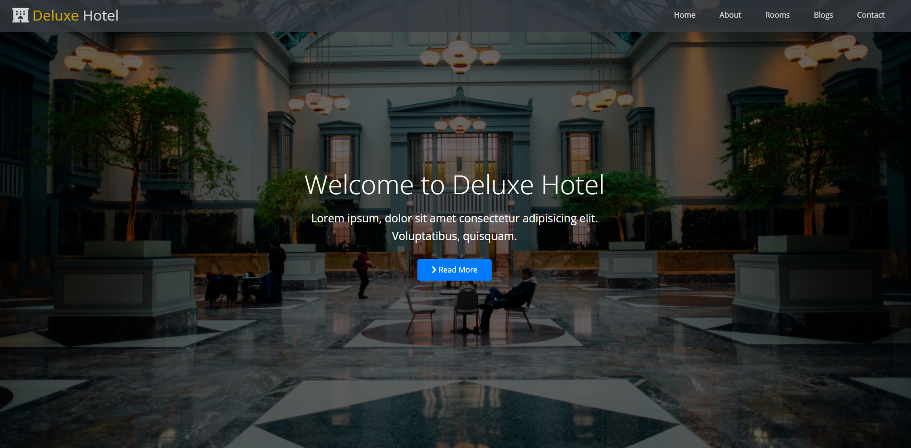

# Udemy Kursu Uygulaması Deluxe Hotel Site

Bu proje, Udemy’deki ([Sadık Turan ] Sıfırdan ileri seviyeye Fullstack Web Geliştirme: HTML, CSS, Bootstrap, JavaScript, React, ASP.NET Core ve API ) kapsamında yapılan uygulamanın birebir ya da benzer bir versiyonudur.

## Amaç

Bu uygulamanın amacı, ilgili kurstaki temel kavramları ve teknolojileri pratiğe dökmek ve kendi başıma çalışarak öğrenmeyi pekiştirmektir.

## Özellikler

- Html
- css
 
 kullanıldı

## Kullanım

index.html,blogs.html

## Notlar

- Bu proje bir Udemy kursu kapsamında yapılmıştır.
- Kodun büyük bölümü eğitim amaçlıdır ve üretim ortamı için uygun olmayabilir.

